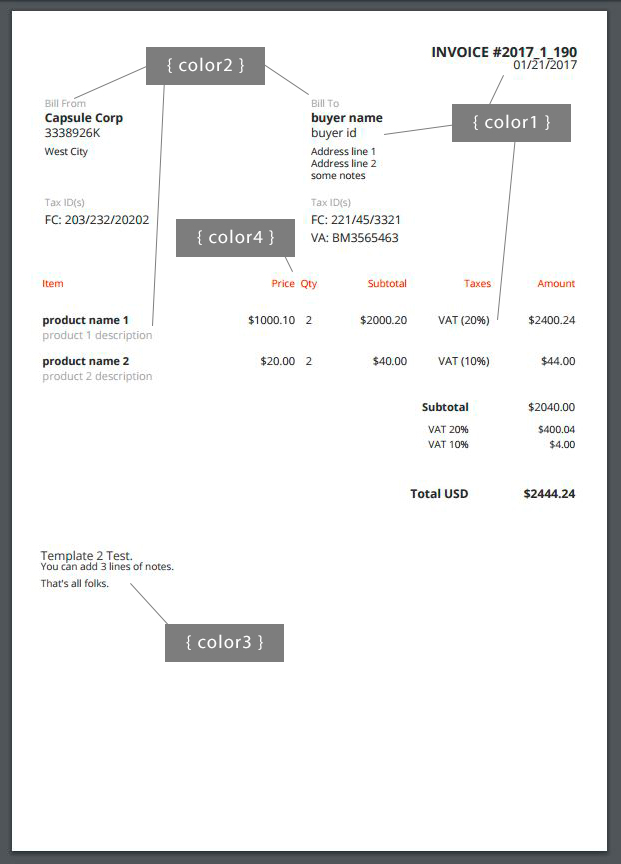

# Introduction

> "Hello world!" invoice definition example.

```javascript
var invoice = {
  "buyer": {
    "name": "ACME Corporation"
  },
  "items": [
    {
      "name": "ACME ARTIFICIAL ROCK",
      "unitPrice": 1000.10,
      "quantity": 2,
      "itemTotalAmount": 2000.20
    }
  ],
  "totals": {
    "total": 2044.20
  }
};

```

```csharp
var invoice = new Model.Invoice() {
	Buyer = new Model.Actor() {
		Name = "ACME Corporation"
	},
	Items = new List<Model.InvoiceItem>() {
		 new Model.InvoiceItem() {
			 Name = "ACME ARTIFICIAL ROCK",
			 UnitPrice = 1000.10m,
			 Quantity = 2,
			 ItemTotalAmount = 2000.20m
		 } },
	Totals = new Model.InvoiceTotals() {
		Total = 2044.20m 
	}
};
```

Welcome to **invoicing.services** API documentation! 

You can use this API to create and store invoice PDF files online and get access from anywhere. 

<aside class="success">
To install the .NET SDK, just get the nuget package <strong>invoicing.services.sdk.dotNET</strong>.
</aside>

When a new invoice is created, you will get a link to your invoice PDF file like:  

[https://s3-us-west-2.amazonaws.com/files.invoicing.services/9bdbd202-b0e1-4d4a-913b-2f9eb1731ce7/dummies/2016/12/7cb0557e-bbd9-4625-84cf-76e7afec9d57.pdf](https://s3-us-west-2.amazonaws.com/files.invoicing.services/9bdbd202-b0e1-4d4a-913b-2f9eb1731ce7/dummies/2016/12/7cb0557e-bbd9-4625-84cf-76e7afec9d57.pdf). 

Use this link share your invoice.

<aside class="notice">
Invoice files will be available for at least 5 years.
</aside>

Invoices are stored on [Amazon Web Services S3](https://aws.amazon.com/s3/) and each PDF file is coded with a unique GUID (f.ex. `7cb0557e-bbd9-4625-84cf-76e7afec9d57`). 

The directory where your invoices are stored cannot be listed by other users, but anyone with an invoice link can access the PDF file.

## Dashboard

By using invoicing.service API you will also get some useful sales reports.

<aside class="notice">
Remember to include the countryCode parameter if you want to get sales by country.
</aside>


# API endpoint

To call **invoicing.services** API methods, use **https://api.invoicing.services/v2** API endpoint .

For example, to create a new Invoice, you call the metod `https://api.invoicing.services/v2/invoice/add`.

# Authentication

```javascript
$.ajax({
    method: 'POST',
  	...
    headers: {
      'Content-Type': 'application/json',
      'X-Api-Key': 'my-api-key'
    },
   	...
  });
```

```csharp

 InvoicingAPI API = new InvoicingAPI("my-api-key");

```


**invoicing.services** uses API keys to allow access to the API methods. You can get an API key at our [website](https://invoicing.services).

We expect for the API key to be included in all API requests to the server in a header that looks like the following:

`'X-Api-Key': 'my-api-key'`

<aside class="notice">
You must replace <code>my-api-key</code> with your personal API key.
</aside>

# Passing parameters

Method call parameters must be passed in the Body part of the request message using [JSON](https://en.wikipedia.org/wiki/JSON) format.

The `Content-Type` header attribute must be set to `application/json`.

```javascript

// How to set dates and numbers.

{
	
	...
	
	"date" : "1482932562"
	
	...
	
	"total" : 19.99
	
	...
	
	"countryCode" : "FR"
	
	...
	
}
```

```csharp
// Setting CountryCode to "FR" (France) will show prices 
// like "20,01" and dates like "31/12/2017".

AddInvoiceResponse response = API.AddInvoice(new Model.Invoice() {
	...
	Date = Utils.Timestamp.CurrentTimeMillis(),
	...
	UnitPrice = 20.01m,
	...
	CountryCode = "FR",
	
 });
 
 
```

### Invoice Dates Format

When setting dates, use [Unix time format](https://en.wikipedia.org/wiki/Unix_time). 

For example, `1482932562` date value translates to `Wednesday, 28-Dec-16 13:42:42 UTC`.

### Invoice Numbers Format

Invoice numbers must use the dot "." symbol as the decimal mark (f.ex. 20.99). This is due to [JSON format](http://www.json.org/) requirements.

If you need to display a diferent format (f.ex. 20,99) please check Invoice Country Code parameter.

### Invoice Country Code

Invoice country code (f.ex. `US`) is used to format currency and date values (and also to calculate some country related statistics). 

An example.

You may need to use the EUR currency code and display values using the French format (f.ex. 24,99 EUR). In that case you must set `countryCode` to `FR` value.


# API Calls Response

> API call `seller/get` response example


```
{
 "statusCode":200,
 "statusMessage":"",
 "info":  "{
    \"id\":\"543433243\",
    \"name\":\"ACME Corporation\",
    \"line1\":\"Rock Heaven\",
    \"line2\":\"Toons\",
    \"line3\":\"USA\"
    \"logoUrl\":\"https://s3-us-west-2.amazonaws.com/temp.invoicing.services/ACME.jpg\"
  }"
}
```

> API call error response example


```
{
 "statusCode":404,
 "statusMessage":"incorrect parameters - user not found",
 "info":  ""
}
```


When calling the API, you can get an [HTTP](https://en.wikipedia.org/wiki/Hypertext_Transfer_Protocol) layer transport error, that is, an error that has ocurried before the related API code is executed (e.g. 503, Service Unavailable), or a *controlled error*, meaning an error that is related to the parameters values you send (e.g. 404, not found - when no data is found for your query). By using this strategy, you will be able to catch and differentiate all kind of API call errors easily.

<br/>
When no transport layer error is detected, all the API calls will include the next message in the BODY part of the response:


Parameter | Type | Description 
--------- | -------  | ----------- 
statusCode | number | The api call result code, using [HTTP status codes values](https://en.wikipedia.org/wiki/List_of_HTTP_status_codes) (e.g. 200 indicates no error).
statusMessage | string | The status code related message.
info | string* | The related requested information.
<br/><br/>
Please take note that the info result parameter may be just a simple text or a more complex json schema (check the examples on the right).


# Seller API

## <span style="color:green">seller/update</span>

> Update seller example 

```javascript
var sellerJson = {
    "id": "3338926K",
    "name": "Capsule Corp",
    "line1": "West City",
    "taxIds": [
      {
        "name": "FC",
        "value": "203/232/20202"
      }
    ],
	"logoUrl": "https://s3-us-west-2.amazonaws.com/temp.invoicing.services/ACME.jpg"
}

$.ajax({
    method: 'POST',
    url: 'https://api.invoicing.services/v2/seller/update',
    data: JSON.stringify(sellerJson),
    headers: {
      'Content-Type': 'application/json',
      'X-Api-Key': 'ExV0d92KzQ8QgsTVnevddpbB8cUaAfPs7ntVF8g0'
    },
    dataType: 'json',
    success: function (response) {
      console.log(response); 
    },
    error: function (xhr, textStatus, errorThrown) {
      console.log(xhr);
    }
  });
```

```csharp
InvoicingAPI API = new InvoicingAPI("ExV0d92KzQ8QgsTVnevddpbB8cUaAfPs7ntVF8g0");

Model.Actor response = API.UpdateSeller(new Model.Actor() {
	Id = "3338926K",
	Name = "Capsule Corp",
	Line1="West City",
	TaxIds = new List<Model.ActorTaxId>() {
		 new Model.ActorTaxId() {
			 Name = "FC",
			 Value = "203/232/20202"
		 }
	},
	LogoUrl = "logoUrl": "https://s3-us-west-2.amazonaws.com/temp.invoicing.services/ACME.jpg"
});
```


> If successfull, the call will return the updated structure (same values as input).


Use this method to set your `Bill From` data so you don't have to include that info each time you create a new Invoice. 

<aside class="notice">
You can also sing-in to your account to setup that info from the web.
</aside>

### HTTP Request

`POST https://api.invoicing.services/v2/seller/update`

### Request Parameters

Parameter | Type | Description | Notes
--------- | -------  | ----------- | -------
id | string | Actor (seller/buyer) id. | [optional]
name | string | Name.
line1 | string | Used to describe seller/buyer. |  [optional]
line2 | string | Additional info. |  [optional]
line3 | string | Additional info. |  [optional]
taxIds | array | List of tax codes.  | [optional]
logoUrl | string | Image Url to your logo image | [optional] Must be less than 100Kb.

where TaxIds is a list of `Tax Codes`.

### Tax codes

Parameter | Type  | Description 
--------- | ------- | ----------- 
name | string | Tax name (f.ex. VA). 
value | string | Tax Value (f.ex. BEB75884746). 

## <span style="color:green">seller/get</span>


```javascript
$.ajax({
    method: 'POST',
    url: 'https://api.invoicing.services/v2/seller/get',
    data: null,
    headers: {
      'Content-Type': 'application/json',
      'X-Api-Key': 'ExV0d92KzQ8QgsTVnevddpbB8cUaAfPs7ntVF8g0'
    },
  ...
  });
```

Use this method to get your `Bill From` default values.


### HTTP Request

`POST https://api.invoicing.services/v2/seller/get`

### Request Parameters

This call does not need any parameter. 

# Invoice API
<a name="invoice-add"></a>
## <span style="color:green">invoice/add</span>

```javascript
$.ajax({
    method: 'POST',
    url: 'https://api.invoicing.services/v2/invoice/add',
    data: JSON.stringify(invoiceJson),
    headers: {
      'Content-Type': 'application/json',
      'X-Api-Key': 'ExV0d92KzQ8QgsTVnevddpbB8cUaAfPs7ntVF8g0'
    },
    dataType: 'json',
    success: function (response) {
      console.log(response); 
    },
    error: function (xhr, textStatus, errorThrown) {
      console.log(xhr);
    }
  });
```
```csharp
InvoicingAPI API = new InvoicingAPI(MY_API_KEY);

AddInvoiceResponse response = API.AddInvoice(invoice);
```

> The above command returns JSON structured like this:

```javascript
{
	"invoiceId": "2016_12_1",
	"invoiceDate": "1482945673350",
	"invoiceFileURL": "https://.../63226081-0eb4-4046-ab27-166261f70dc6.pdf"
}
```

```csharp
public class AddInvoiceResponse
{
	public string InvoiceId { get; set; }
	public string InvoiceDate { get; set; }
	public string InvoiceFileURL { get; set; }
}
```

> Extensive invoice definition example:

```javascript
var invoice = {
  "currencyCode": "USD",
  "countryCode": "US",
  "seller": {
    "id": "3338926K",
    "name": "AXTIA TECHNOLOGIES",
    "line1": "West City"
  },
  "buyer": {
    "id": "Rabbit 1988",
    "name": "ACME Corporation",
    "line1": "Looney Tunes Street",
    "line2": "El Coyote",
    "taxIds": [
      {
        "name": "FC",
        "value": "203/232/20202"
      }    
    ]

  },
  "items": [
    {
      "name": "ACME ARTIFICIAL ROCK",
      "description": "Have hours of amusement pretending to be a rock with the ACME Artificial Rock.",
      "unitPrice": 1000.10,
      "taxes": [
        {
          "taxRate": 20,
          "taxName": "VAT"
        }
      ],
      "quantity": 2,
      "itemSubTotalAmount": 2000.20,
      "itemTotalAmount": 2400.04
    },
    {
      "name": "ACME ASPIRIN",
      "description": "ACME is recognized worldwide as a leading producer of acetylsalicylic acid.",
      "unitPrice": 20,
      "taxes": [
        {
          "taxRate": 10,
          "taxName": "VAT"
        }
      ],
      "quantity": 2,
      "itemSubTotalAmount": 40.00,
      "itemTotalAmount": 44.00
    }
  ],
  "totals": {
    "subTotal": 2040.20,
    "taxTotals": [
      {
        "taxRate": 20,
        "taxName": "VAT",
        "taxTotal": 400.04
      },
      {
        "taxRate": 10,
        "taxName": "VAT",
        "taxTotal": 4.00
      }
    ],
    "total": 2444.04
  },
  "notes": {
    "line1": "The Complete Illustrated Catalog of ACME Products",
    "line2": "Payment 60 days after invoice date.",
    "line3": "That's all folks."
  },
  "labels": {
    "title": "INVOICE #",
    "sellerLabel": "Bill From:",
    "SellerTaxIdsLabel": "Tax ID(s)",
    "buyerLabel": "Bill To:",
    "BuyerTaxIdsLabel": "Tax ID(s)",
    "itemsListItem": "Item",
    "itemsListPrice": "Price",
    "itemsListQty": "Qty",
    "itemsListSubtotal": "Subtotal",
    "itemsListTotal": "Total",
    "subtotal": "Subtotal",
    "total": "Total"
  },
  "colors": {
    "color1": "#2E2E2E",
    "color2": "#585858",
    "color3": "#424242"
  }

};
```

```csharp
new Model.Invoice() {
          
	Id="0000123",
	Date = Utils.Timestamp.CurrentTimeMillis(),
	CurrencyCode = "USD",
	CountryCode = "US",
	Seller = new Model.Actor() {
		Id="My Seller ID",
		Name="I am a Seller",
		Line1="This is my address.",
		TaxIds= new List<Model.ActorTaxId>() {
			new Model.ActorTaxId() {
				Name="FEV",
				Value="774646/OL"
			},
			new Model.ActorTaxId() {
				Name="FR",
				Value="US7758847"
			}
		}
	},
	Buyer = new Model.Actor() {
		Id="INTERNAL 00212",
		Name = "My First Invoice Buyer",
		Line1 = "Company Address Line 1",
		Line2 = "Address Line 2",
		TaxIds = new List<Model.ActorTaxId>() {
			new Model.ActorTaxId() {
				Name = "FR",
				Value="US9093930"
			}
		}
	},
	Items = new List<Model.InvoiceItem>() {
		 new Model.InvoiceItem() {
			 Name = "My Product Name",
			 Description = "Product description.",
			 UnitPrice = 20.01m,
			 Quantity = 2,
			 Taxes = new List<Model.Tax>() {
				 new Model.Tax() {
					 TaxName = "VAT",
					 TaxRate = 10
				 }
			 },
			 ItemSubTotalAmount = 40.02m,
			 ItemTotalAmount = 44.02m
		 } },
	Totals = new Model.InvoiceTotals() {
		 SubTotal = 40.02m,
		 TaxTotals = new List<Model.InvoiceTaxTotal>() {
			 new Model.InvoiceTaxTotal() {
				 TaxName="VAT",
				 TaxRate=10,
				 TaxTotal=4.00m
			 }
		 },
		Total = 44.02m
	},
	Notes = new Model.TextBlock() {
		Line1="This is a note to include some text/conditions."
	},
	Labels = new Model.Labels() {
		Title = "QUOTATION",
		Total = "Total Quotation"
	},
	Colors = new Model.Colors() {
		Color1 = "#766755"
	}
};
```

Use this method to create a new invoice.

### HTTP Request

`POST https://api.invoicing.services/v2/invoice/add`

### Invoice Ids

If you want your invoice id to be automatically generated by the system, do not include the `id` parameter on the request.


<aside class="notice">
Automatic invoice ids will be formatted as [year_month_number] where the last number is initialized every month. 
</aside>


### Dummy Invoices

To test how the API works you can use the `dummy` parameter. If set to `true`, your invoice will be saved on a separate folder and will not be counted.

### Request Parameters

Parameter | Type | Default | Description | Notes
--------- | -------  | ----------- | ----------- | -------
dummy | boolean | false | If set to true, invoice is not counted. | [optional]
id | string | | Invoice Id. | [optional]
date | timestamp | current date | Invoice date. | [optional]
currencyCode | string | USD | [currency ISO code](https://en.wikipedia.org/wiki/ISO_4217) | [optional] 
countryCode | string | US | [country ISO code](https://en.wikipedia.org/wiki/ISO_3166-1_alpha-2) | [optional]
seller | array |  | Invoice actor (seller) attributes. |
buyer | array |  | Invoice actor (buyer) attributes. |
items | array | | Items list. |
totals | array |  | Totals attributes.|
notes | array | | Notes. | [optional].
labels | array | | Labels texts. | [optional].
colors | array | | Invoice template colors. | [optional]


### Actor (seller/buyer) Parameters

Parameter | Type | Default | Description | Notes
--------- | -------  | ----------- | ----------- | -------
id | string | | Actor (seller/buyer) id. | [optional]
name | string | | Name.
line1 | string | | Used to describe seller/buyer. |  [optional]
line2 | string | | Additional info. |  [optional]
line3 | string | | Additional info. |  [optional]
taxIds | array | | List of tax codes.  | [optional]

### Actor (seller/buyer) Tax codes

Parameter | Type | Default | Description
--------- | -------  | ----------- | ----------- 
name | string | | Tax name (f.ex. VA). | 
value | string | | Tax Value (f.ex. BEB75884746). | 

### Invoice Item

Parameter | Type | Default | Description | Notes
--------- | -------  | ----------- | ----------- | -------
name | string | | Product/Service name.  | 
description | string | | Description. | [optional]
unitPrice | number | | Unit price. | 
taxes | array | | List of Tax. | [optional]
quantity | number | | Quantity. | 
itemSubTotalAmount | number | | Item total before taxes. | 
itemTotalAmount | number | | Item total including all taxes. | 

### Tax

Parameter | Type | Default | Description 
--------- | -------  | ----------- | -----------
taxRate | number | | tax rate (f.ex. 20). 
taxName | string | | tax name (f.ex. VAT). 
taxTotal | number | | tax total.

### Invoice Totals

Parameter | Type | Default | Description | Notes
--------- | -------  | ----------- | ----------- | -------
subtotal | number | | Invoice total without taxes.  | [optional]
taxTotals | array | | List of Tax. | [optional]
total | number | | Invoice Total.  | 

### Invoice Notes

Use invoice notes to add any extra text you want to include.

Parameter | Type | Default | Description 
--------- | -------  | ----------- | -----------
line1 | string | | First line.  | 
line2 | string | | Second line.  | 
line3 | string | | Third line.  | 

### Invoice Labels

Use these parameters to change the default labels texts.

Parameter | Type | Default 
--------- | -------  | ----------- 
title | string | INVOICE # 
invoiceNumber | string | Invoice Number 
invoiceDate | string | Invoice Date 
sellerLabel | string | Bill From 
SellerTaxIdsLabel | string | Tax ID(s) 
buyerLabel | string | Bill To 
BuyerTaxIdsLabel | string | Tax ID(s)
itemsListItem | string | Item 
itemsListPrice | string | Price  
itemsListQty | string | Qty 
itemsListSubtotal | string | Subtotal
itemsListTotal | string | Total 
subtotal | string | Subtotal 
total | string | Total 

### Invoice Colors

Use these parameters to change the default template colors. 

To check how the colors are used, we recommend that you create a `dummy` invoice for testing. You can check for color values [here](http://www.w3schools.com/colors/colors_picker.asp).

Parameter | Type | Default | Description 
--------- | -------  | ----------- | ----------- 
color1 | string | #2E2E2E | Template color.
color2 | string | #585858 | Template color.
color3 | string | "#424242" | Template color.


## <span style="color:green">invoice/list</span>

```javascript

var queryJson = { "year":2017 };
$.ajax({
    method: 'POST',
    url: 'https://api.invoicing.services/v2/invoice/list',
    data: JSON.stringify(queryJson),
    ...
  });
```
```csharp
InvoicingAPI API = new InvoicingAPI(MY_API_KEY);
ListInvoiceResponse response = API.ListInvoice(new Model.APIQueries.ListInvoiceQuery() { 
	Year = 2017, 
	Quarter = 1 
});

```

> The above command returns:

```javascript
{
  "query": {
    "year": 2017
  },
  "count": 2,
  "list": [
    {
      "invoiceGuid": "2e898d14-e2fd-4d87-9403-75f1871c28b2",
      "invoiceId": "2017_1_5",
      "invoiceDate": 1483871723354,
      "invoiceBuyerName": "ACME Corporation",
      "invoiceTotal": 2044.2,
      "invoiceCurrency": "USD",
      "invoiceUrl": "https://..913b-2f9eb1731ce7/2017/01/2e898d14-e2fd-4d87-9403-75f1871c28b2.pdf"
    },
    {
      "invoiceGuid": "785bdaea-b575-4485-a886-b194af161a11",
      "invoiceId": "2017_1_7",
      "invoiceDate": 1483871733325,
      "invoiceBuyerName": "ACME Corporation",
      "invoiceTotal": 2444.04,
      "invoiceCurrency": "USD",
      "invoiceUrl": "https://..2-b0e1-4d4a-913b-2f9eb1731ce7/2017/01/785bdaea-b575-4485-a886-b194af161a11.pdf"
    }
  ]
}
```

```csharp

 public class ListInvoiceResponse {
   
	public APIQueries.ListInvoiceQuery Query { get; set; }
	public int Count { get; set; }
	public List<ListInvoiceResponseItem> List { get; set; }
		
}


public class ListInvoiceResponseItem{
        
	public string InvoiceGuid { get; set; }
	public string InvoiceId { get; set; }
	public long InvoiceDate { get; set; }
	public string InvoiceBuyerName { get; set; }
	public decimal InvoiceTotal { get; set; }
	public string InvoiceCurrency { get; set; }
	public string InvoiceUrl { get; set; }
}
```


Use this method to get a list of invoices within a specific period of time

### HTTP Request

`POST https://api.invoicing.services/v2/invoice/list`

### Request Parameters

To get invoice list you must pass at least the `year` paramater. Here are some examples:

* Query example 1: { "year":2017 }

* Query example 2: { "year":2017, "quarter":2 }

* Query example 3: { "year":2017, "month":4, "day":15 }


Parameter | Type | Default | Description | Notes
--------- | -------  | ----------- | ----------- | -------
year | int | - | invoices year we want to get list |
quarter | int | - | allowed values: 1 to 4 representing Quarter 1,2,3 or 4 | [optional]
month | int | - | invoices month we want to get list | [optional]
day | int | - | invoices day we want to get lit | [optional]

<aside class="notice">
If `quarter` parameter is set, `month` and `day` will be discarded.
</aside>


## <span style="color:green">invoice/get</span>

```javascript
var queryJson = { "invoiceGuid":"a657de6e-3afe-4af5-b95e-288d3df472d0" };
$.ajax({
    method: 'POST',
    url: 'https://api.invoicing.services/v2/invoice/get',
    data: JSON.stringify(queryJson),
    ...
  });
```


```csharp

InvoicingAPI API = new InvoicingAPI(MY_API_KEY);
Invoice response = API.GetInvoice(new GetInvoiceQuery() {
	InvoiceGuid = "e234cd8f-4c66-4855-a5b4-23816fea6f23"
});

```

> The above command returns an Invoice structure (check example [here](#invoice-add))


Use this method to get a specific Invoice JSON formatted data.

### HTTP Request

`POST https://api.invoicing.services/v2/invoice/get`

### Request Parameters

Each time you create an Invoice a new GUID is assigned. Use that GUID value to get the related Invoice JSON when required.


Parameter | Type | Default | Description 
--------- | -------  | ----------- | ----------- 
invoiceGuid | string | - | Invoice GUID 


# Available Templates


Invoice template is selected by setting the `templateNumber` parameter when calling the `invoice/add` API method. 

<aside class="notice">
Change invoice colors using the colors parameters to meet your requirements.
</aside>

You can search for color codes on [Colors Picker](http://www.w3schools.com/colors/colors_picker.asp) website. If you want to test how your Invoices look, remember to set the `dummy` parameter on invoice creation.

<aside class="warning">
If no template is selected, the default template is used.
</aside>

## Default Template (1).

```csharp

AddInvoiceResponse response = API.AddInvoice(new Model.Invoice() {
	...
	TemplateNumber = 1,
	...
	Colors = new Colors() {
		Color1 = "#766755",
		Color2 = "#e62e00",
		Color3 = "#33ccff",
		Color4 = "#99ffcc"
	}
	
 });
 
 
```



## Template Number 2.

```csharp

AddInvoiceResponse response = API.AddInvoice(new Model.Invoice() {
	...
	TemplateNumber = 2,
	...
	Colors = new Colors() {
		Color1 = "#766755",
		Color2 = "#e62e00",
		Color3 = "#33ccff",
		Color4 = "#99ffcc",
		Color5 = "#cc33ff"
	}
	
 });
 
 
```
If you want to include your company logo image, you must update your `Bill To` data using the `seller/update` API method including an Url reference to your logo image. 

The image will then be saved on our servers and used on this template.


